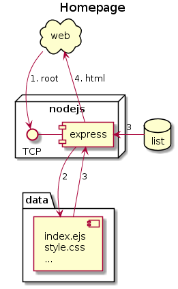
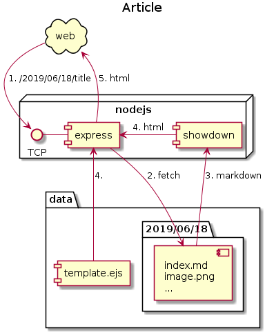
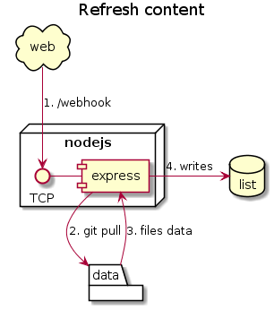

# GitBlog.md


[](https://travis-ci.org/Klemek/GitBlog.md)
[](https://coveralls.io/github/Klemek/GitBlog.md?branch=master)

A static blog using Markdown pulled from your git repository.

* **[How it works](#how-it-works)**
* **[Installation](#installation)**
* **[Writing an article](#writing-an-article)**
* **[Modules](#modules)**
* **[Configuration](#configuration)**

## How it works
[back to top](#gitblog-md)

There are 4 majors features of this project :

#### 1. Home page

<details>
<summary>diagram (click)</summary>
<p>


</p>
</details>

When you access the root url of your blog, the app will fetch the template and inject the list of currently available articles.


#### 2. Article page

<details>
<summary>diagram (click)</summary>
<p>


</p>
</details>

As you access an article link, the server will fetch it's `index.md` Markdown file and render it in plain HTML using Showdown.


#### 3. Git webhook

<details>
<summary>diagram (click)</summary>
<p>


</p>
</details>

As you configured your data repository, when you push any data, it will trigger the webhook that will perform a `git pull` then refresh the data you just committed.


#### 4. RSS feed

<details>
<summary>diagram (click)</summary>
<p>


</p>
</details>

On the `/rss` endpoint, the servers gives you a RSS feed based on the list of articles which you can bookmark.


## Installation
[back to top](#gitblog-md)

#### 1. Download and install the latest version from the repo
```bash
git clone https://github.com/klemek/gitblog.md.git
npm install
```
#### 2. Create your config file
```bash
cd gitblog.md
cp config.example.json config.json
```
then edit the config.json file with your custom values.
For example, you might want to change the app's port with :

```json
{
  "node_port": 3030
}
```

See [Configuration](#configuration) for more info.

#### 3. Start your server

```bash
npm run
#or
node src/server.js
```

You can check that it's up and running at [http://localhost:3000/](http://localhost:3000/)

You might want to use something like screen to separate the process from your current terminal session.

#### 4. Customize the blog's style

At `npm install` a first article will be created for the current date.
You can see it as an example of rendering of your blog.
Use it to edit your templates and styles located on the `data` folder.

At first, home page and articles are rendered using EJS engine but you can customize that into the configuration.

Resources are located on the `data` folder and can be referenced as the root of your blog.

```
/styles/main.css => data/styles/main.css
```

#### 5. Create and init your git source

You need to [create a new repository](https://github.com/new) on your favorite Git service.

```bash
#gitblog.md/
cd data
git remote add origin <url_of_your_repo.git>
git push -u origin master
```

Now you just have to edit a local copy of your articles and, when you push them, to perform a simple `git pull` on that data folder.

#### 6. Refresh content with a webhook (optional)

Create a webhook on your git source (On GitHub, in the `Settings/Webhooks` part of the repository.) with the following parameters :

* Payload URL : `https://<url_of_your_server>/webhook`
* Content type : `application/json`
* Events : Just the push event

Now the server will perform the `git pull` task for you after a successful push on GitHub.

#### 7. Securize your webhook (optional)

Here are the steps for Github, if you use another platform adapt it your way (header format on the config) :

* Create a password or random secret
* Edit your configuration to add webhook info 
```json
"webhook": {
    "endpoint": "/webhook",
    "secret": "sha1=<value>",
    "signature_header": "X-Hub-Signature"
  },
```
* Launch the server
* Update your webhook on github to include the secret
* Check if Github successfully reached the endpoint

## Writing an article
[back to top](#gitblog-md)

You need to write your article (and templates) on the git repository but **keep the data directory on the server untouched** to prevent any changes to harm the git pull normal behavior.

To be referenced, an article need to be on a specific path containing its date and have a Markdown index file :

```
data/year/month/day/index.md
```

> note that month and day need to be 0 padded (`5th of june 2019 => 2019/06/05`)

On your Markdown file you can write anything but some informations will be fetched automatically :

* Title : first level 1 header (#)
* Thumbnail : first thumbnail tagged image (like ``)

On that same folder, you can place resources like images and reference them in relative paths :

```
 => data/year/month/day/image.png
```

> note that you cannot place resources on subfolders

Any URL like `/year/month/day/anything/` will redirect to this article (and link to correct resources)

## Modules
[back to top](#gitblog-md)

* **RSS**  
  It allows your users to use the feed to be updated as soon as a new article is out
* **Webhook**  
  It update your blog from your online repo when it's updated
* **Prism**  
  It highlight code blocks to be more readable (more info [here](https://prismjs.com/), you will need the corresponding CSS file on your templates)
* **MathJax**  
  It allows you to add math equations to your articles by simply writing LaTeX between $$ for full size (and between $ for inline) (more info [here](https://www.mathjax.org/))

## Configuration
[back to top](#gitblog-md)

*  `node_port` (default: 3000)  
  the port the server is listening to
* `data_dir` (default: data)  
  the directory where will be located the git repo with templates and articles
* `view_engine` (default: ejs)  
  the Express view engine used to render pages from templates
* `access_log` (default: access.log)  
  log file where to save access requests (empty to disable)
* `error_log` (default: error.log)  
  log file where to save all server errors (empty to disable)
* `modules`
   * `rss` (default: true)  
     activate the RSS endpoint and its features
   * `webhook` (default: true)  
     activate the webhook endpoint and its features
   * `prism` (default: true)  
     activate Prism code highlighting
   * `mathjax` (default: true)  
     activate MathJax equations formatting
* `home`
   * `index` (default: index.ejs)  
     the name of the home page template on the data directory  
     it will receive `articles`, a list of articles for rendering
   * `error` (default: error.ejs)  
     the name of the error page template on the data directory  
     it will receive `error`, the error code
   * `hidden` (default: `[.ejs]`)  
     file extensions to be returned 404 when reached
* `article`
   * `index` (default: index.md)  
     the name of the Markdown page of the article on the `/year/month/day/` directory
   * `template` (default: template.ejs)  
     the name of the article page template on the data directory
   * `thumbnail_tag`: (default: thumbnail)  
     the alt text searched to get the thumbnail image on the article  
     as in ``
   * `default_title`: (default: Untitled)  
     the title of the article in case a level 1 title was not found
   * `default_thumbnail`: (default: none)  
     the path of the default thumbnail to get from the data directory
* `rss`
   * `title`: (default: mygitblog RSS feed)
   * `description`: (default: a generated RSS feed from my articles)
   * `endpoint`: (default: /rss)
   * `length`: (default: 10)  
     how many last articles will be present in the feed
* `webhook`
   * `endpoint`: (default: /webhook)
   * `secret`: (default: none)  
     see [above](#7-securize-your-webhook-optional-)
   * `signature_header`: (default: none)  
     see [above](#7-securize-your-webhook-optional-)
   * `pull_command`: (default: git pull)  
     the command used by the server on webhook trigger
* `showdown`  
  Options to be applied to Showdown renderer (see [showdown options](https://github.com/showdownjs/showdown/wiki/Showdown-Options) for more info)
* `mathjax`
   * `output_format`: (default: svg)  
     specify the output format between svg, html or MathMl (mml)
   * `speak_text`: (default: true)  
     activate the alternate text in equations
