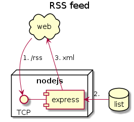

# GitBlog.md (WIP)
> This is a work in progress, some information written here might not be true yet.

[](https://travis-ci.org/Klemek/GitBlog.md)
[](https://coveralls.io/github/Klemek/GitBlog.md?branch=master)

A static blog using Markdown pulled from your git repository.

## Flow




## Installation
**1. Download and install the latest version from the repo**
```bash
git clone https://github.com/klemek/gitblog.md.git
npm install
```
**2. Create your config file**
```bash
cd gitblog.md
cp config.example.json config.json
```
then edit the config.json file with your custom values.

**3. Start your server**

```bash
npm run
#or
node src/server.js
```

You might want to use something like screen to separate the process from your current terminal session.

**4. Create and init your git source**

You need to [create a new repository](https://github.com/new) on your favorite Git service.

```bash
#gitblog.md/
cd data
git remote add origin <url_of_your_repo.git>
git push -u origin master
```

**5. Refresh content with a webhook (optional)**

Create a webhook on your git source (On GitHub, in the `Settings/Webhooks` part of the repository.) with the following parameters :

* Payload URL : `https://<url_of_your_server>/webhook`
* Content type : `application/json`
* Events : Just the push event

**6. Securize your webhook (optional)**

Here are the steps for Github, if you use another platform adapt it your way (header format on the config) :

* Create a password or random secret
* Edit your configuration to add webhook info 
```json
{
...
"webhook": {
    "endpoint": "/webhook",
    "secret": "sha1=<value>",
    "signature_header": "X-Hub-Signature"
  },
...
}
```
* Launch the server
* Update your webhook on github to include the secret
* Check if Github successfully reached the endpoint